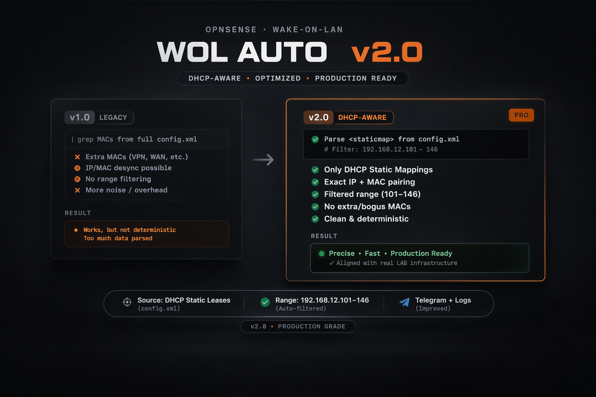

# OPNsense WOL Auto v2.0

Automatización de encendido de equipos mediante Wake-on-LAN (WOL) en OPNsense, con validación de feriados en Chile y notificaciones vía Telegram.

## 🚀 Características

* Encendido automático por WOL
* Integración con DHCP Static Mappings
* Filtrado por rango de IP (192.168.12.101–146)
* Verificación de equipos mediante ping
* Notificaciones por Telegram (mensaje + log)
* Detección automática de feriados en Chile
* Integración con `configd` (actions)
* Compatible con cron de OPNsense

---

## 📂 Estructura

* `wol_auto.sh` → Script principal
* `wol_auto(multi).sh` → opcional, si tienes mas de un lab prefiere usar este
* `actions_wolauto.conf` → Integración con OPNsense configd
* `cron_example.txt` → Ejemplo de tarea programada

---

## ⚙️ Requisitos

* OPNsense
* DHCP con Static Mappings configurado
* Wake-on-LAN habilitado en los equipos (configuracion Windows y Bios)
* Tener Bot Telegram puedes revisar el archivo `crear_bot.txt`
* Acceso a internet (para API de feriados y Telegram)

---

## 🔧 Instalación

### 1. Copiar script

```bash
nano /usr/local/bin/wol_auto.sh
chmod +x /usr/local/bin/wol_auto.sh
```

---

### 2. Configurar variables

Editar dentro del script:

```bash
BROADCAST="192.168.12.255"
BOT_TOKEN="TU_TOKEN"
CHAT_ID_1="TU_CHAT_ID"
```

---

### 3. Crear acción en OPNsense

```bash
nano /usr/local/opnsense/service/conf/actions.d/actions_wolauto.conf
```

---

### 4. Reiniciar configd

```bash
service configd restart
```

---

### 5. Ejecutar manualmente

```bash
configctl wolauto start
```

---

### 6. Configurar cron

Ver archivo `cron_example.txt`

---

## 🧠 Cómo funciona

El script lee `/conf/config.xml` y extrae:

* MAC addresses
* IPs desde DHCP Static Mappings

Filtra automáticamente el rango:

```
192.168.12.101 - 192.168.12.146
```

---

## 🔐 Seguridad

* No usa credenciales en texto plano (excepto Telegram)
* No depende de archivos externos
* Ejecución controlada por OPNsense

---

## 📡 Notificaciones

* Inicio de proceso
* Resultado final
* Log completo como archivo adjunto

---

## ⚠️ Notas

* No funcionará si no existen static mappings en DHCP
* Requiere que WOL esté habilitado en BIOS/NIC
* Requiere Bot Telegram revisa como crear aqui ---> `crear_bot.txt`
* Requiere configurar el entorno windows puedes seguir esta guia 
---> https://www.geeknetic.es/Guia/3096/Como-encender-de-forma-remota-un-PC-usando-Wake-On-Lan.html

## 🔧 Configuración de rango de IP `wol_auto.sh`

El script utiliza una función llamada es_ip_valida() para determinar qué equipos deben ser encendidos.

📌 Ubicación

Dentro del script encontrarás:

es_ip_valida() {
    ip=$1
    ultimo=$(echo "$ip" | awk -F. '{print $4}')

    case $ip in
        192.168.12.*)
            [ "$ultimo" -ge 101 ] && [ "$ultimo" -le 146 ] && return 0
            ;;
    esac

    return 1
}
✏️ Cómo modificar el rango
🔹 Cambiar solo el rango

Ejemplo: 192.168.12.50–80

[ "$ultimo" -ge 50 ] && [ "$ultimo" -le 80 ] && return 0

🔹 Cambiar la red
Ejemplo: 192.168.20.10–40

case $ip in
    192.168.20.*)
        [ "$ultimo" -ge 10 ] && [ "$ultimo" -le 40 ] && return 0
        ;;
esac

🔹 Agregar múltiples rangos (multi-lab)
case $ip in
    192.168.11.*)
        [ "$ultimo" -ge 101 ] && [ "$ultimo" -le 146 ] && return 0
        ;;
    192.168.12.*)
        [ "$ultimo" -ge 101 ] && [ "$ultimo" -le 146 ] && return 0
        ;;
esac
⚠️ Recomendaciones
Mantener rangos específicos evita encender dispositivos innecesarios
No usar rangos abiertos (ej: 1–254) en redes grandes
Asegurarse de que las IP coincidan con los DHCP Static Mappings
